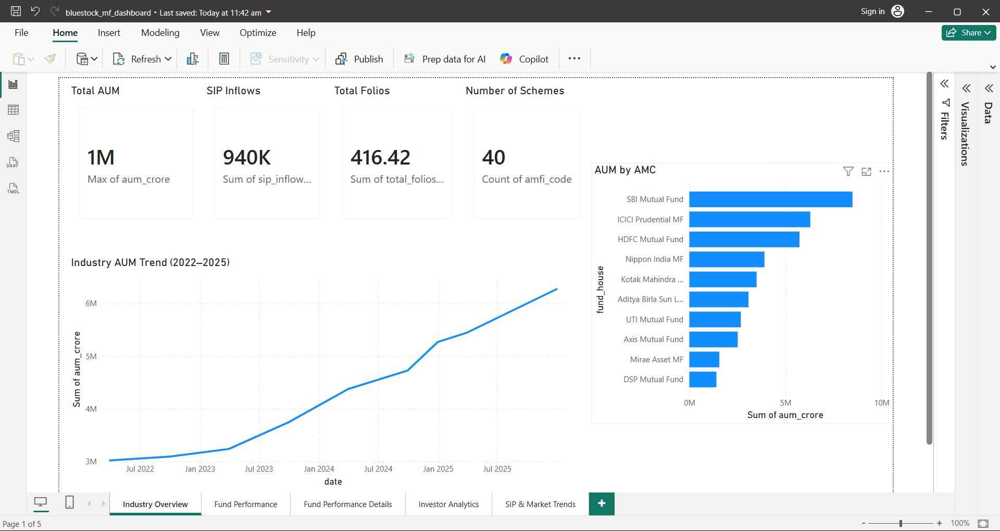
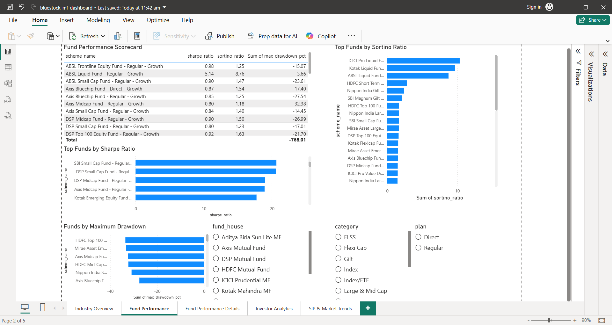
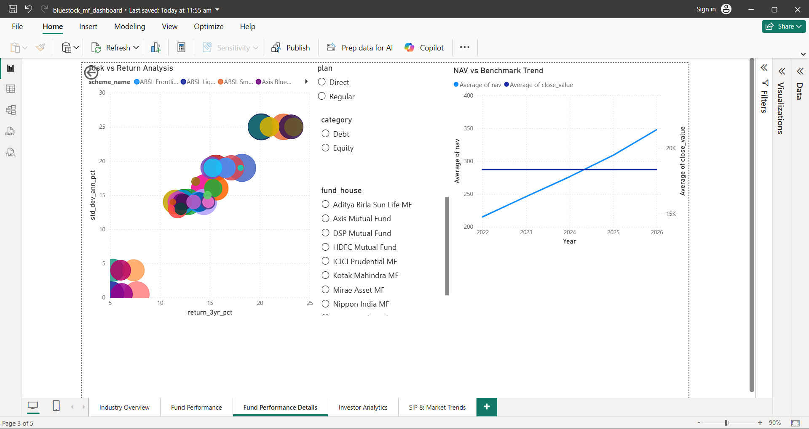
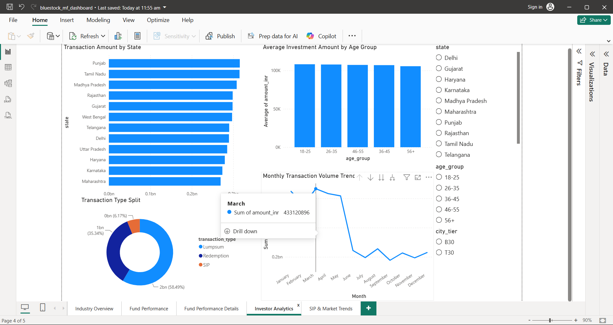

# Mutual Fund Analytics Platform

## Project Overview

The Mutual Fund Analytics Platform is an end-to-end data analytics solution developed during the Bluestock Fintech Internship. The project integrates multiple mutual fund datasets, performs data cleaning and preprocessing, stores data in SQLite, conducts exploratory and advanced analytics, and presents insights through an interactive Power BI dashboard.

The platform helps analyze:

- Fund performance
- Investor demographics
- SIP trends
- Portfolio risk metrics
- Category inflows
- Mutual fund rankings
- Recommendation-based fund selection

---

## Project Objectives

- Analyze mutual fund performance using return and risk metrics
- Study investor demographics and participation trends
- Evaluate SIP growth and continuity patterns
- Perform advanced risk analytics using VaR and CVaR
- Build a mutual fund recommendation engine
- Develop an interactive Power BI dashboard

---

## Technology Stack

### Programming

- Python
- SQL

### Libraries

- Pandas
- NumPy
- Matplotlib
- Seaborn
- Scikit-Learn

### Database

- SQLite

### Visualization

- Power BI

### Development Environment

- Jupyter Notebook

---

## Project Workflow

Data Sources

↓

Data Ingestion

↓

Data Cleaning & Preprocessing

↓

SQLite Database

↓

Exploratory Data Analysis

↓

Fund Performance Analytics

↓

Advanced Analytics

↓

Recommendation Engine

↓

Power BI Dashboard

---

## Datasets Used

- Fund Master
- NAV History
- SIP Inflows
- Category Inflows
- Industry Folio Counts
- Scheme Performance
- Investor Transactions
- Portfolio Holdings
- Benchmark Indices

---

## Key Analytics Performed

### Exploratory Data Analysis

- Age Group Distribution
- Gender Distribution
- City Tier Analysis
- SIP Trends
- Industry Folio Growth
- Category Inflow Heatmaps

### Fund Performance Analytics

- Top Funds by AUM
- Top Funds by 3-Year Returns
- Morningstar Rating Analysis
- Fund House Analysis

### Risk Analytics

- Sharpe Ratio
- Sortino Ratio
- Alpha
- Beta
- Maximum Drawdown
- Value at Risk (VaR)
- Conditional Value at Risk (CVaR)

### Advanced Analytics

- Correlation Analysis
- SIP Continuity Analysis
- Investor Cohort Analysis
- Fund Recommendation Engine

---

## Power BI Dashboard Features
## Dashboard Preview

| Industry Overview | Fund Performance |
|------------------|------------------|
|  |  |

| Fund Details | Investor Analytics |
|-------------|-------------------|
|  |  |

- Investor Analytics
- Fund Performance Monitoring
- SIP Trend Analysis
- Risk Analysis
- Fund Ranking Dashboard
- Portfolio Insights

---

## Key Findings

- Investors aged 25–45 form the largest participation group.
- Male investors account for approximately 66% of total investors.
- T30 cities contribute significantly more investors than B30 cities.
- SIP inflows show a strong upward trend.
- Several mutual fund schemes delivered returns above 20%.
- Most schemes belong to moderate-risk categories.

---

## Repository Structure

```text
bluestock_mf_capstone
│
├── dashboard
├── data
├── notebooks
├── reports
├── sql
├── README.md
├── Project_Progress.md
└── requirements.txt
```

---

## Author

**Potnuru Kavya Rupini**

Bluestock Fintech Internship Project

2026
